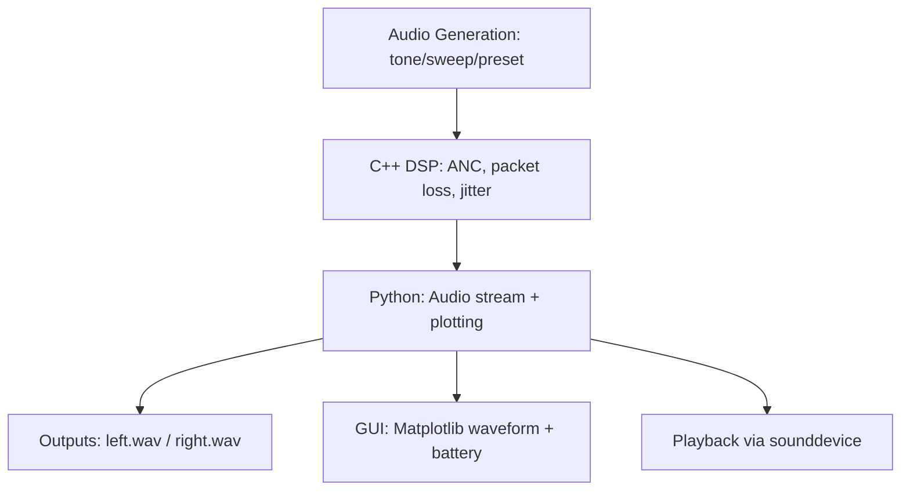

# True Wireless Stereo (TWS) Simulation

A simulation of True Wireless Stereo (TWS) earbuds, combining high-performance C++ digital signal processing (DSP) with an interactive Python GUI.  
This project emulates core TWS audio behaviors: stereo WAV generation, channel splitting, adaptive noise cancellation (ANC), Bluetooth packet loss, jitter, and simple battery modeling, with a Matplotlib dashboard for control and visualization.

It demonstrates cross-language integration between **C++20 (pybind11 bindings)** and **Python 3**, showcasing real-time waveform analysis and DSP.

---

## Features

### C++ DSP (`audio_processor`)
- **Channel Splitting:** Extracts left/right channels from interleaved stereo buffers.
- **ANC (Adaptive Noise Cancellation):** Implements an NLMS (Normalized Least Mean Squares) adaptive filter.  
  - Left = signal + noise (primary)  
  - Right = noise (reference)  
  - Adaptive filter reduces noise on the left channel.
- **Bluetooth Effects:**
  - **Packet Loss:** Drops entire simulated packets with configurable probability.  
  - **Jitter:** Randomly shifts packets by a few milliseconds.
- **Numerical Stability:** Double-precision accumulators, leakage factor for long-term stability, configurable filter length and step size.

### Python Orchestration
- **Audio Generation:**
  - Tones (440Hz/880Hz default, configurable).
  - Frequency sweeps (logarithmic).
  - Presets: white noise, pink noise, speech-like bursts, chord sequences.
- **Playback:** Streams processed stereo audio via [`sounddevice`](https://python-sounddevice.readthedocs.io).
- **GUI Dashboard:** Built with **Matplotlib widgets**, offering:
  - Mode selection (Tone / Sweep / Preset).
  - Frequency, duration, and parameter controls.
  - Packet loss, jitter, ANC toggle.
  - Live waveform visualization (Left/Right channels).
  - Battery percentage bars (Master/Slave).

---

## Project Structure

```
tws_simulation/
├── src/
│   ├── audio_processor.cpp   # C++ DSP: ANC, packet loss, jitter
│   └── audio_processor.hpp
├── python/
│   ├── gui.py          # GUI dashboard
│   └── tws_simulator.py      # Python wrapper (calls C++ backend)
├── outputs/                  # Generated WAVs (ignored in git)
├── assets/                   # Temporary input assets (ignored in git)
├── build/                    # Build artifacts (ignored in git)
├── logs/                     # Log files (optional, ignored in git)
├── .gitignore
├── .clangd                   # clangd config (C++20)
└── README.md
```

---

## Data Flow



---

## Setup

### Prerequisites

**OS:** Linux (tested on Fedora 40, should also work on Ubuntu/Arch).

**C++ Dependencies:**

* g++ or clang with **C++20** support
* [pybind11](https://github.com/pybind/pybind11) headers
* (Optional) [CMake](https://cmake.org) or [Bear](https://github.com/rizsotto/Bear) for generating `compile_commands.json`

**Python Dependencies:**

* Python 3.9+ (tested on Python 3.13)
* Packages:

  ```bash
  pip install numpy matplotlib sounddevice scipy pybind11
  ```

---

## Building

### Using CMake

```bash
mkdir -p build
cd build
cmake .. -DCMAKE_CXX_STANDARD=20 -DCMAKE_EXPORT_COMPILE_COMMANDS=ON
make
```

This builds the `audio_processor` Python extension in `src/`.

### Manual g++ build

```bash
g++ -O3 -Wall -shared -std=c++20 -fPIC \
    -I/usr/include/python3.13 \
    -I$(python3 -m pybind11 --includes | cut -d' ' -f1) \
    src/audio_processor.cpp \
    -o audio_processor$(python3-config --extension-suffix)
```

---
---
## Quick Start
```bash
git clone https://github.com/Spidy104/tws_simulation.git
cd tws_simulation
pip install -r requirements.txt
python python/anim_plot.py
```
---

## Usage

### GUI Mode

Launch the dashboard:

```bash
python python/anim_plot.py
```

Controls:

* **Mode:** Tone / Sweep / Preset
* **Tone:** Set left/right frequencies
* **Sweep:** Start/stop frequencies
* **Preset:** White / Pink / Speech / Chord
* **Duration:** 0.5–10s
* **Packet loss:** % of dropped packets
* **Jitter:** Random jitter in ms
* **ANC:** Toggle adaptive noise cancellation

Outputs:

* `outputs/left.wav`, `outputs/right.wav`: Processed stereo WAVs
* Matplotlib window: Real-time waveform plots and battery bars

---

## Technical Details

### ANC (Adaptive Noise Cancellation)

* Algorithm: **Normalized LMS (NLMS)** adaptive filter
* Configurable filter length (`L`), step size (`μ`), and leakage
* Learns to subtract the reference noise (right channel) from the primary signal (left channel)

### Bluetooth Effects

* **Packet Loss:** Bernoulli drop of 20ms blocks
* **Jitter:** Random per-packet shifts, clipped at edges

### Battery Model

* Simplified: Fake percentage bars updated in GUI
* Placeholder values (not energy-accurate)

---

## Screenshots

### Main Dashboard

*Interactive Matplotlib GUI with waveform visualization, ANC toggle, and battery status bars.*
---

## Future Enhancements

* Expose ANC parameters dynamically from GUI
* Add more realistic battery drain model
* Square/sawtooth waveform generation
* Block-based ANC for efficiency
* Real Bluetooth integration on Raspberry Pi

---

## License

MIT License.