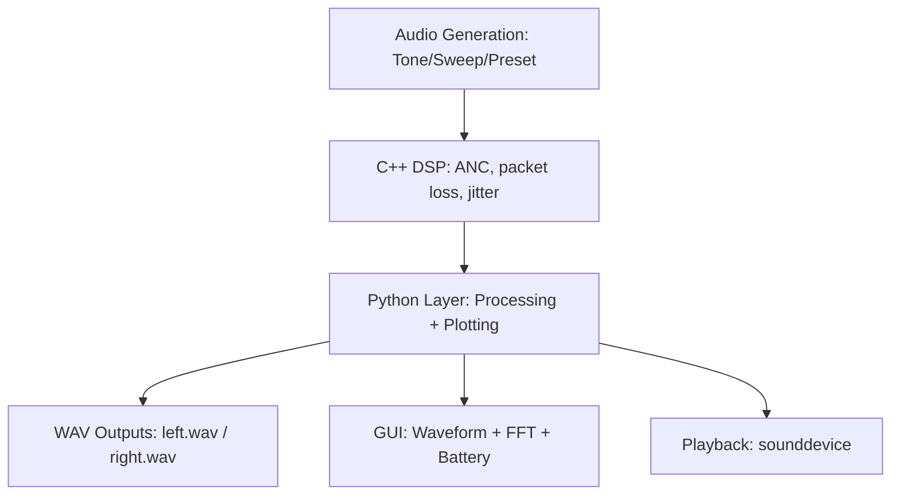
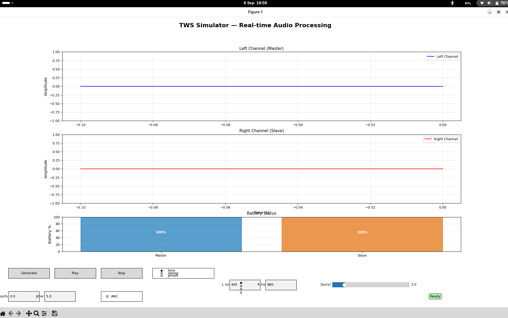

# True Wireless Stereo (TWS) Simulation

An interactive **simulation of True Wireless Stereo earbuds**, combining high-performance **C++20 digital signal processing (DSP)** with a **Python GUI**.

The project emulates core TWS audio behaviors:

* Stereo WAV generation (tones, sweeps, presets)
* Channel splitting
* Adaptive noise cancellation (ANC)
* Bluetooth artifacts (packet loss, jitter)
* Simplified battery drain model

A **Matplotlib dashboard** provides real-time visualization of audio waveforms, FFTs, and battery levels.
This project also demonstrates **cross-language integration** between **C++ (pybind11 bindings)** and **Python 3** for real-time DSP.

---

## ✨ Features

### C++ DSP Modules

* **Channel Splitting** — Extracts left/right channels from interleaved stereo streams.
* **ANC (Adaptive Noise Cancellation)** — NLMS (Normalized Least Mean Squares) adaptive filter:
  * Left channel = signal + noise (primary)
  * Right channel = noise (reference)
  * Learns to suppress noise on the left channel.
* **Bluetooth Simulation**
  * **Packet Loss**: Drops entire packets at configurable probability.
  * **Jitter**: Random time shifts of audio packets.
* **Numerical Stability** — Double precision accumulators, leakage factors, and configurable filter parameters.

### Python Layer

* **Audio Generation**
  * Pure tones (default 440 Hz / 880 Hz).
  * **Frequency sweeps** (logarithmic).
  * **Presets**: white noise, pink noise, speech-like bursts, chord sequences.
* **Playback** — Real-time audio streaming via [`sounddevice`](https://python-sounddevice.readthedocs.io).
* **Interactive GUI** — Matplotlib dashboard with:
  * Mode selection: *Tone / Sweep / Preset / ANC*
  * Sliders for frequency, duration, packet loss, jitter
  * Battery status bars (Master / Slave)
  * Waveform & FFT visualization

---

## 📂 Project Structure

```
tws_simulation/
├── src/                    # C++ DSP modules (pybind11 extensions)
│   ├── audio_processor.cpp   # ANC, packet loss, jitter
│   ├── battery_model.cpp     # Simple battery model
│   ├── wav_generator.cpp     # Tone/sweep/preset WAV generator
│   └── *.hpp                 # Headers
├── python/                 # Python layer
│   ├── gui.py                # GUI dashboard (Matplotlib)
│   └── tws_simulator.py      # Python wrapper & fallback simulator
├── outputs/                 # Generated WAVs (ignored in git)
├── assets/                  # Input assets (ignored)
├── build/                   # Build artifacts
├── logs/                    # Optional logs
├── Makefile / CMakeLists    # Build system
└── README.md
```

---

## 🔄 Data Flow



---

## ⚙️ Setup

### Prerequisites

**OS:** Linux (tested on Fedora 40; should work on Ubuntu/Arch).

**C++ Dependencies**

* g++ or clang with **C++20**
* [pybind11](https://github.com/pybind/pybind11) headers
* (Optional) CMake or Bear for `compile_commands.json`

**Python Dependencies**

```bash
pip install numpy matplotlib sounddevice scipy pybind11
```

---

## 🛠️ Building

### With CMake

```bash
mkdir -p build
cd build
cmake .. -DCMAKE_CXX_STANDARD=20 -DCMAKE_EXPORT_COMPILE_COMMANDS=ON
make
```

### With g++

```bash
g++ -O3 -Wall -shared -std=c++20 -fPIC \
    -I/usr/include/python3.13 \
    $(python3 -m pybind11 --includes) \
    src/audio_processor.cpp \
    -o src/audio_processor$(python3-config --extension-suffix)
```

---

## 🚀 Quick Start

```bash
git clone https://github.com/Spidy104/tws_simulation.git
cd tws_simulation
pip install -r requirements.txt
python python/anim_plot.py
```

---

## 🎛️ Usage (GUI)

Run the dashboard:

```bash
python python/anim_plot.py
```

### Controls

* **Mode**: Tone / Sweep / Preset / ANC
* **Tone**: Set left/right frequencies
* **Sweep**: Define start & end frequencies
* **Preset**: Choose White / Pink / Speech / Chord
* **Duration**: 0.5–10s
* **Packet loss**: % of dropped packets
* **Jitter**: Random jitter (ms)
* **ANC**: Toggle adaptive noise cancellation

### Keyboard Shortcuts

* **Space** — Start/Stop simulation
* **G** — Generate audio
* **P** — Play audio

### Outputs

* `outputs/left.wav`, `outputs/right.wav` — processed audio
* GUI window — waveform, FFT, battery visualization

---

## 🔍 Technical Notes

### ANC

* NLMS (Normalized LMS) adaptive filter
* Configurable filter length, step size (`μ`), leakage
* Learns noise reference (right channel) and cancels from primary (left)

### Bluetooth Artifacts

* **Packet Loss**: Bernoulli drop of 20ms blocks
* **Jitter**: Random time shifts per packet

### Battery Model

* Simplified toy model for GUI visualization
* Master and Slave drain at different rates, ANC increases drain

---

## 📸 Screenshot



---

## 🚧 Future Enhancements

* Expose ANC parameters dynamically in GUI
* More realistic battery drain curves
* Add square/sawtooth waveform generators
* Optimize block-based ANC
* Real Bluetooth integration (e.g., Raspberry Pi)

---

## 🤝 Contributing

1. Fork the repository
2. Create a feature branch (`git checkout -b feature/amazing-feature`)
3. Commit your changes (`git commit -m 'Add some amazing feature'`)
4. Push to the branch (`git push origin feature/amazing-feature`)
5. Open a Pull Request

---

## 📜 License

MIT License

---

## 📧 Contact

Project Link: [https://github.com/Spidy104/tws_simulation](https://github.com/Spidy104/tws_simulation)
